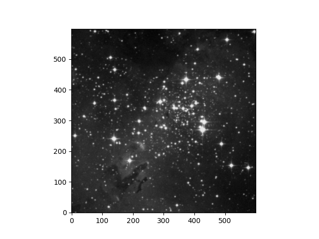
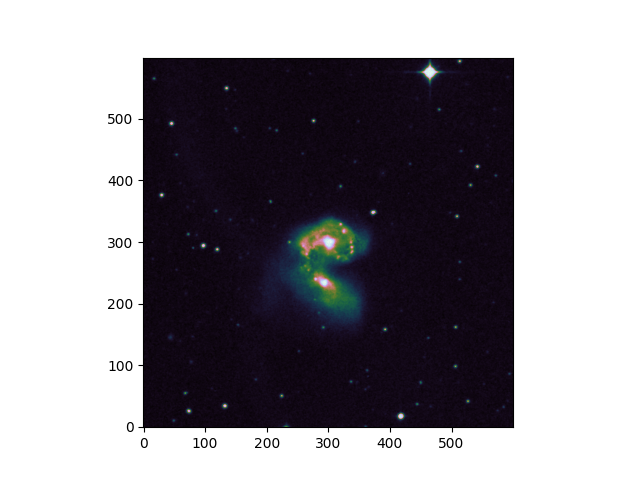
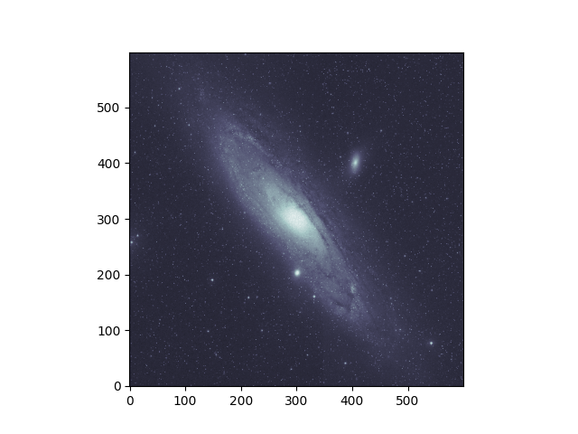
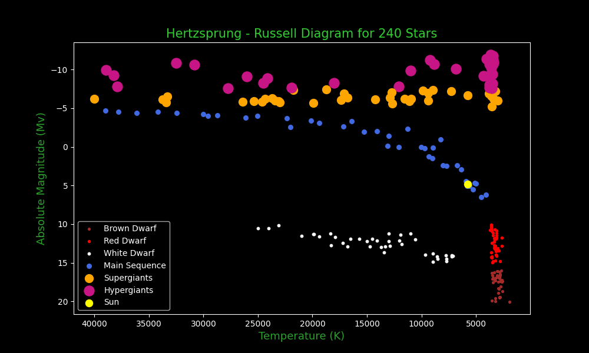
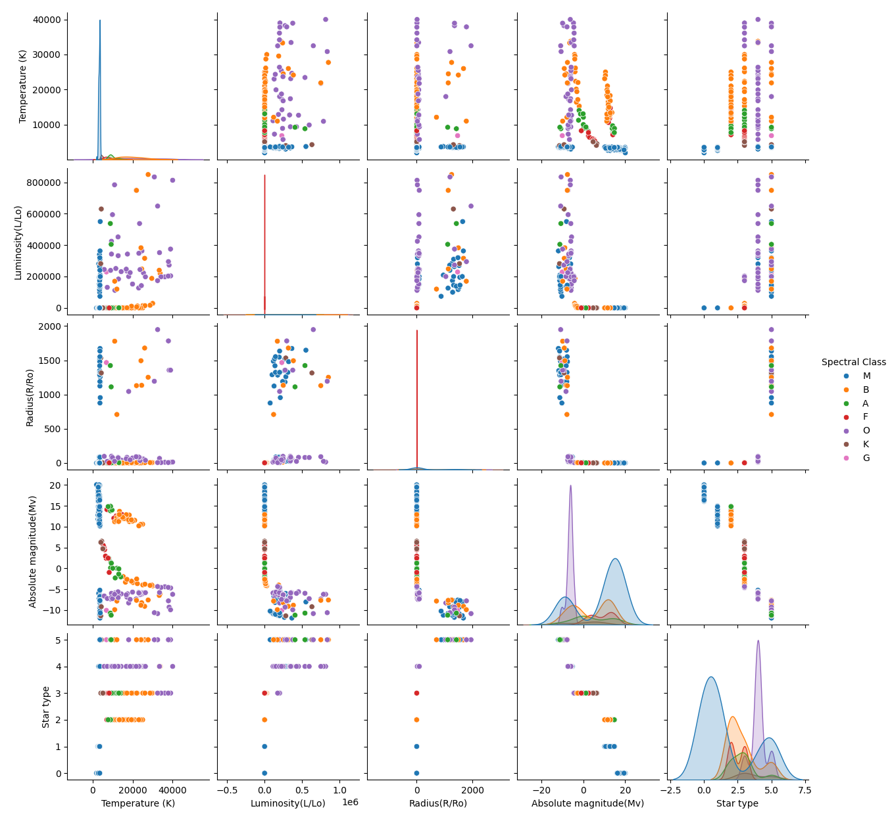
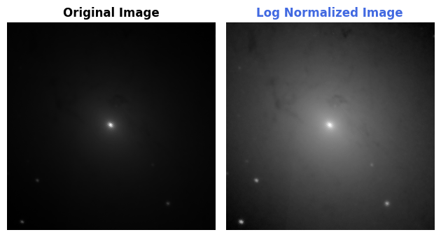
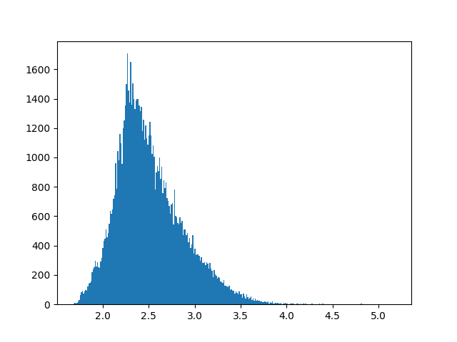
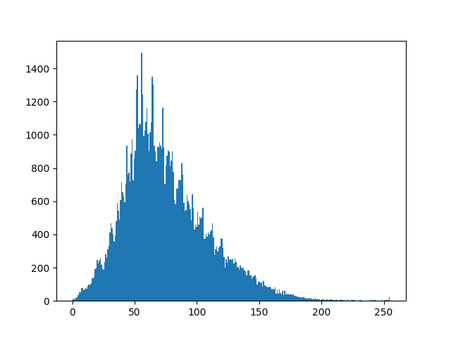
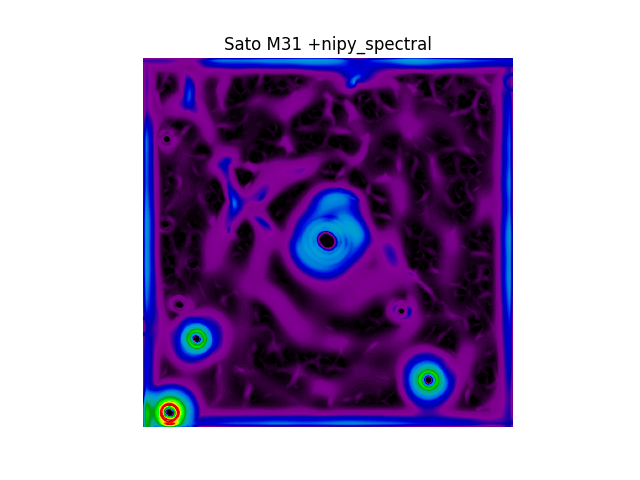

# astro-data-analysis

## 1. Astronomical Data Analysis 
## 2. FITS Data Analysis and Image Processing

* Eagle Nebula - DSS2 IR

* NGC 4038/39 - DSS2 IR

* Andromeda - DSS2 Blue

* Hertzsprung - Russell Diagram for stars

* Scatter pairplot of numerical features

* M31 Log Normalized with Histogram

* M31 ZScaleInterval Historgram

* M31 Sato Filter

